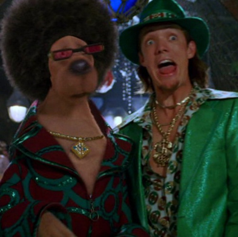
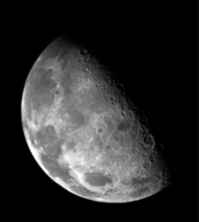
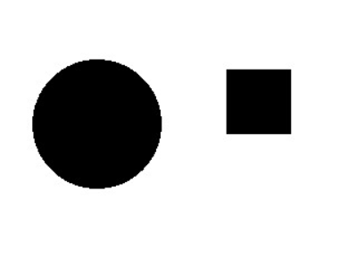
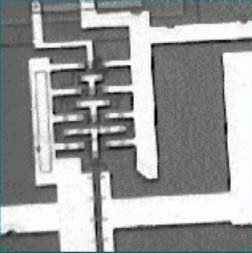
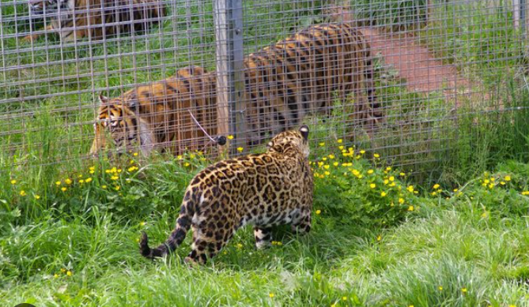
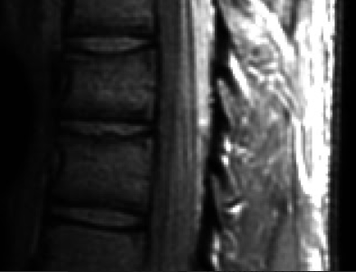

# Digital Image Processing

An academic Digital Image Processing (DIP) project implementing pixel-level image manipulation **from scratch**, without relying on image-processing libraries (no OpenCV, no GDI+ image filters, no third-party codecs). Every transformation — from parsing the BMP binary header to computing a Sobel gradient — is hand-written.

The project has two independent implementations built by the same authors for the same course assignment:

| Implementation | Language | Interface | Focus |
|---|---|---|---|
| **C** | C | Command-line | Low-level BMP binary file manipulation |
| **Pascal** | Object Pascal (Free Pascal / Lazarus) | Desktop GUI | Full image-processing filter suite |

## Authors
* João Gabriel Bezerra
* Rennan Furlaneto Collado

## Project Structure

```
Digital-Processing-Image-main/
├── C/
│   └── teste.c                         # BMP header parsing, copy, grayscale, negative
├── Pascal/
│   └── Processamento-Digital-de-Imagens_Trabalho1/
│       └── Trabalho_PDI/
│           ├── unit1.pas               # Main form: filters, transforms, noise, channels
│           ├── unit2.pas               # RGB <-> HSV color model conversion form
│           └── project1.lpi            # Lazarus project file
├── images/
│   ├── raw/                            # Original / input images
│   └── processed/                      # Generated / filtered output images
└── CODE_REVIEW_TASKS.md                # Known issues & refactoring backlog
```

## Features

### C Implementation — Binary BMP Manipulation

`teste.c` reads an uncompressed 24/32-bpp BMP file byte by byte, parsing its `BMPHeader` and `DIBHeader` structs directly from the file stream (no library does this for you), then writes new BMP files with modified pixel data while preserving the original header layout.

* **BMP Header Parsing** (`lerCabecalhos`) — reads and validates the file header and DIB (bitmap info) header, exposing width, height, bit depth, and data offset.
* **Header Inspection** (`exibirInformacoes`) — prints the parsed header fields to the console for debugging/verification.
* **Image Copy** (`copiarImagem`) — duplicates the raw pixel stream byte-for-byte into a new file (`copia.bmp`), proving the header parsing round-trips correctly.
* **Grayscale Conversion** (`converterCinza`) — applies the luminosity method to collapse each pixel's RGB triplet into a single grayscale intensity, writing all three channels back with that value.
* **Negative Conversion** (`negativarImagem`) — inverts each RGB channel (`255 - value`) to produce a photographic negative.

The program's `main()` runs all three operations in sequence against a single input file (`imagem.bmp`), producing `copia.bmp`, `imagem_Cinza.bmp`, and `imagem_Negativa.bmp`.

### Pascal Implementation — GUI Filter Suite

A Lazarus/Free Pascal desktop application (`unit1.pas`, ~1050 lines) exposing every operation through a menu bar, plus a secondary form (`unit2.pas`) dedicated to color-model conversion. Below is the actual menu structure, with each item's underlying capability:

**Arquivo (File)**
* Abrir Imagem / Salvar Imagem / Sair — open, save, and exit.

**Operações (Operations)**
* **Binarização** — thresholding an image into pure black/white based on an intensity cutoff.
* **Converter para Cinza** — grayscale conversion (luminosity-based).
* **Compressão de Escala Dinâmica** — dynamic range compression / gamma-style intensity remapping to enhance contrast in over/under-exposed images.
* **Equalizar** — histogram equalization to redistribute intensity levels and improve global contrast.
* **Suavizar (Smoothing)**
  * Media Np(4) / Media Np(8) — mean (averaging) filter over a 4- or 8-neighborhood.
  * Mediana (3x3) — 3×3 median filter for noise reduction while preserving edges.
* **Gerar Ruído → Sal e Pimenta** — synthetic salt-and-pepper noise generator.
* **Inverter Imagem** — Horizontal and Vertical flip.
* **Interpolar → Vizinho Mais Próximo** — nearest-neighbor interpolation for image resizing.
* **Laplaciano** — Laplacian filter for edge/detail detection via second-derivative approximation.
* **Limiarizar** — threshold-based segmentation.
* **Negativar** — Cinza (grayscale negative) and Colorida (full-color negative).
* **Separar Canal** — extracts pure Azul (Blue), Verde (Green), Vermelho (Red) channels, plus grayscale-mapped single-channel views (Cinza/Azul, Cinza/Verde, Cinza/Vermelho).
* **Sobel** — Completo (combined gradient magnitude), Horizontal, and Vertical edge detection operators.

**Conversão de Modelo de Cores (Color Model Conversion)**
* A dedicated dialog (`unit2.pas`) with bidirectional **RGB → HSV** and **HSV → RGB** conversion (`RgbToHsv`, `HsvToRgb`), including input validation for each color space's valid ranges.

## Image Gallery

All sample images live under [`images/`](images/), split into the originals the algorithms consumed and the outputs they produced.

### Edge Detection (Pascal Implementation)

| Original (Raw) | Laplacian Filter | Sobel Operator |
|:---:|:---:|:---:|
|  |  |  |

### Noise Generation (Pascal Implementation)

| Original (Raw) | Salt & Pepper Noise |
|:---:|:---:|
|  |  |

### Dynamic Range Compression (Pascal Implementation)

| Original (Raw) | Dynamic Range Compression |
|:---:|:---:|
|  |  |

### Additional Raw Samples

| imagem2.bmp |
|:---:|
|  |

An extra color test image kept alongside the primary samples for manual testing in the Pascal GUI.

## How to Run

### C Code
Navigate to the `C/` directory, compile `teste.c` with GCC, and run the executable. Make sure a valid `imagem.bmp` is present in the same directory (it is the hardcoded input filename).

```bash
cd C
gcc teste.c -o teste -lm
./teste
```

This generates `copia.bmp`, `imagem_Cinza.bmp`, and `imagem_Negativa.bmp` next to the input file.

### Pascal Code
Open `project1.lpi` (located in `Pascal/Processamento-Digital-de-Imagens_Trabalho1/Trabalho_PDI/`) using the **Lazarus IDE**. Compile and run with the IDE's built-in tools (F9), then use **Arquivo → Abrir Imagem** to load a sample and apply any filter from the **Operações** menu.

## Code Review & Improvements
See [`CODE_REVIEW_TASKS.md`](CODE_REVIEW_TASKS.md) for known issues and suggested refactoring work regarding dynamic memory allocation, code consistency, and test coverage.
